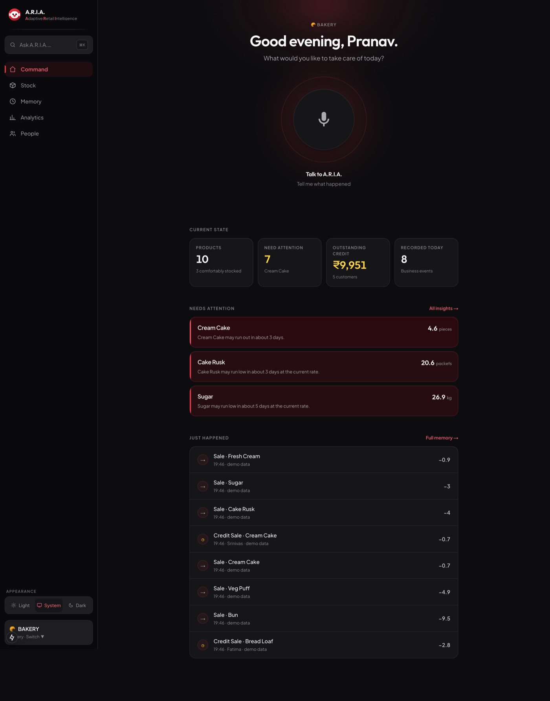
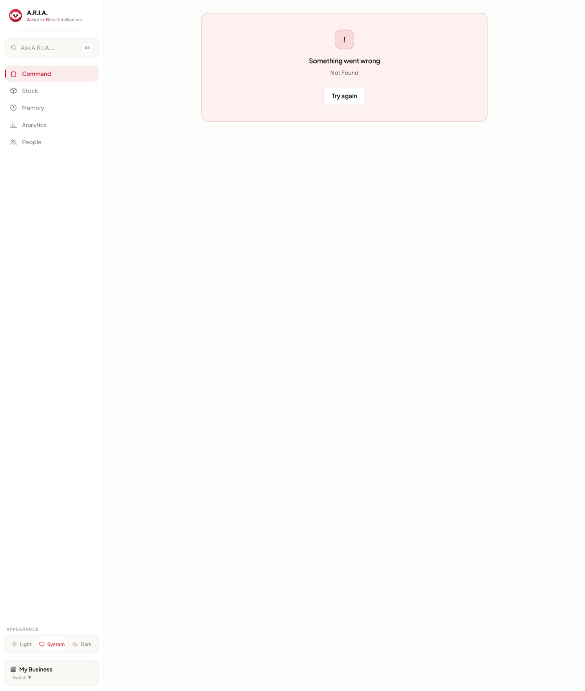
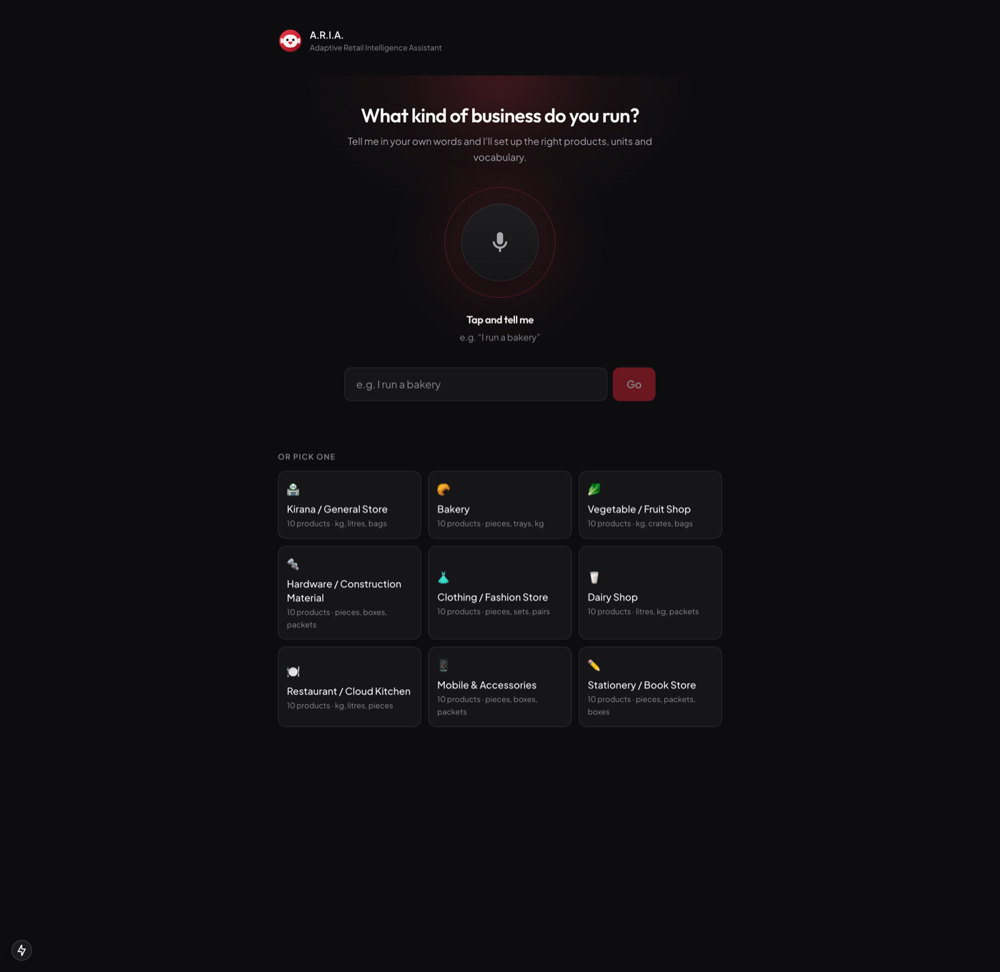
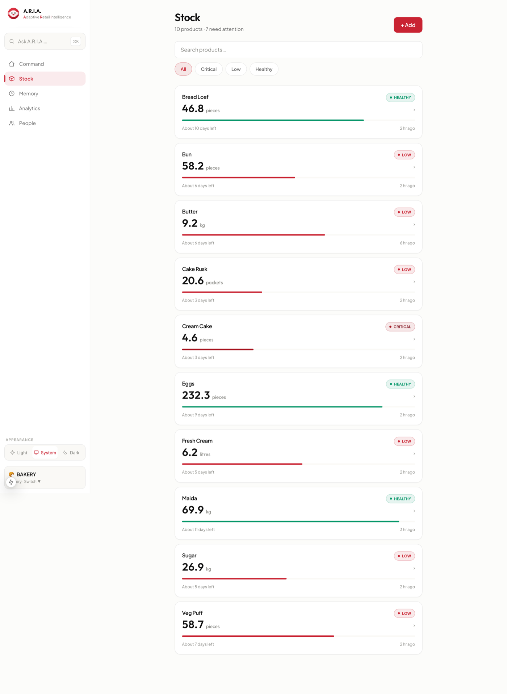
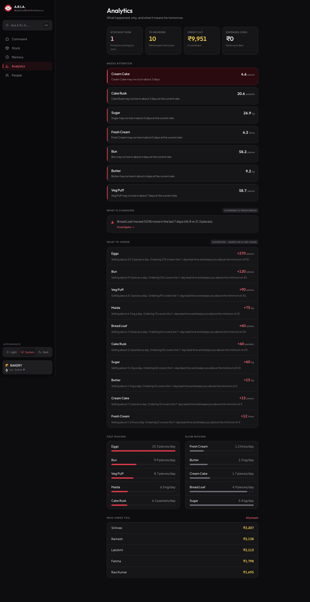
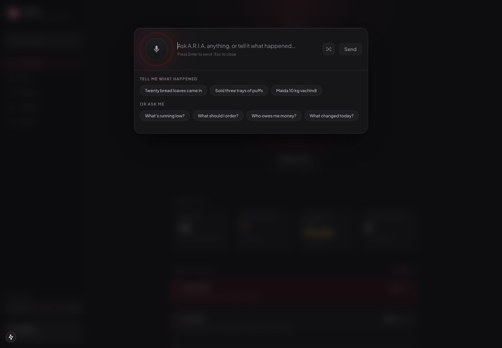
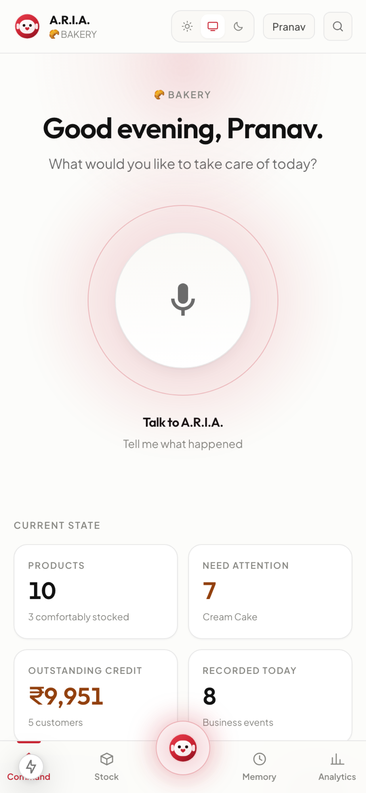

<div align="center">



# A.R.I.A.
### Adaptive Retail Intelligence Assistant

**Speak. Stock. Smarter.**

A voice-first business memory platform for India's small shopkeepers — talk to it the way you'd talk to a trusted assistant, in English, తెలుగు, हिन्दी, or a natural mix of all three, and it keeps your inventory, credit book, and business history for you.

[](frontend)
[](frontend)
[](frontend)
[](frontend)
[](backend)
[](backend)
[](backend)
[](#license)

[Live Demo](#-live-demo) · [Features](#-what-makes-aria-different) · [Screenshots](#-screenshots) · [Architecture](#-architecture) · [Getting Started](#-getting-started) · [Team](#-team)

</div>

<br />

## 💡 The Problem

India has roughly **63 million MSMEs** — the vast majority are small retail shops, kirana stores, pharmacies and wholesalers, run by owners who track inventory in notebooks, memory, and WhatsApp messages. Existing inventory software is form-based, keyboard-heavy, English-centric, and assumes units and workflows that don't match how a real shop actually runs.

The result: stock shortages, forgotten credit, no visibility into *why* something changed, and zero predictive insight — because the tools available were never built for the person actually running the counter.

## ✨ What Makes A.R.I.A. Different

A.R.I.A. isn't a dashboard with a microphone bolted on. **The voice core *is* the product** — everything else exists to give the owner context for the next thing they'll say to it.

| | |
|---|---|
| 🎙️ **Talk, don't type** | Say *"Sold three trays of puffs"* or *"Ramesh took two oil packets, he'll pay tomorrow"* — A.R.I.A. writes it to the ledger as a structured business event, correctly attributed, correctly costed. |
| 🌏 **Understands, not translates** | English, తెలుగు, हिन्दी, and natural code-switched speech are understood as *meaning*, not machine-translated — so "5 kg maida vachindi" just works. |
| 🧠 **A real business memory** | Every event is traceable back to the exact sentence that produced it, when it was said, and how confident A.R.I.A. was — nothing is ever silently guessed. |
| 📊 **Honest intelligence, not vanity charts** | Reorder suggestions, stockout predictions, and unusual-movement alerts are clearly marked as *estimates* — a prediction dressed up as a fact is a lie with a number on it. |
| 💰 **Credit book, built in** | Every "he'll pay later" is tracked per customer automatically, no separate ledger needed. |
| 📸 **Vision** | Point a camera at a delivery invoice or shelf and let A.R.I.A. read it. |
| 🤖 **Real AI, honestly labelled** | The UI always says whether the conversational agent or the deterministic rule engine answered — it never implies AI when there wasn't one. |
| 🌗 **Premium light & dark themes** | A real theme system — Light / Dark / System — not an inverted stylesheet. |

## 🚀 Live Demo

> Deployment link goes here once hosted — see [Getting Started](#-getting-started) to run it locally in under 5 minutes.

## 📸 Screenshots

<div align="center">

**The Command Centre** — A.R.I.A. greets you by name and waits for what you need



<br /><br />

| Onboarding | Inventory |
|:---:|:---:|
|  |  |

| Analytics | Ask A.R.I.A. |
|:---:|:---:|
|  |  |

**Designed for the counter, not just the desk** — the voice core stays the primary action on mobile



</div>

## 🎨 Design System

A.R.I.A.'s visual identity is deliberately restrained: **white, rose red, black, dark red** — warm and welcoming, never a generic SaaS dashboard or a cheap red template.

<div align="center">

| Rose Red | Deep Red | Bright Accent | Warm Wash | Ink Black |
|:---:|:---:|:---:|:---:|:---:|
| `#C92332` | `#7F0F1C` | `#E43B4A` | `#FFF3F4` | `#111111` |

</div>

- Red is used with restraint and always means something: A.R.I.A. is listening, thinking, acting, or confirming.
- Every colour token is theme-aware (CSS custom properties), so **Light, Dark, and System** modes are first-class, not an afterthought — and the choice persists across reloads.
- Typography follows a geometric, rounded, no-serif direction (Outfit for display, Plus Jakarta Sans for interface) — legible down to 10px, confident at 40px.
- The voice core's every visual state — *listening, transcribing, understanding, confirming, acting, done* — reflects what the system is **actually** doing. No state plays a pleasing animation while nothing happens.

## 🏗️ Architecture

```
                     ┌─────────────────────────┐
                     │   Web Speech API (STT)   │   audio never leaves
                     │  browser-native, free    │   the device
                     └────────────┬────────────┘
                                  │ transcript
                                  ▼
┌──────────────────────────────────────────────────────────┐
│                  Next.js 15 · React 19 · TS                │
│  Command Centre · Voice Core · Command Bar · Analytics     │
│  Inventory · Memory Timeline · Customers · Vision · Auth    │
└───────────────────────────┬──────────────────────────────┘
                             │ REST · JSON
                             ▼
┌──────────────────────────────────────────────────────────┐
│                    FastAPI · Python 3.11+                  │
│  ┌────────────┐  ┌───────────────┐  ┌───────────────────┐ │
│  │ Language +  │  │  ARIA Agent   │  │   Event Engine     │ │
│  │ Rule Engine │→ │ (tool-calling)│→ │ (structured writes) │ │
│  └────────────┘  └───────────────┘  └───────────────────┘ │
│  Vocabulary · Product Matcher · Units · Insights · Vision   │
└───────────────────────────┬──────────────────────────────┘
                             │ SQLAlchemy 2.0
                             ▼
                   ┌───────────────────┐
                   │   PostgreSQL 15    │
                   │  full event ledger │
                   └───────────────────┘
```

**Design principles**

- **Every data route is scoped through a single dependency** (`require_business`) — an unscoped query across businesses isn't expressible.
- **Nothing is ever silently guessed.** Below the confidence threshold, A.R.I.A. asks for confirmation instead of acting; below the clarification threshold, it says plainly that it isn't sure.
- **Demo data is never dressed up as real trading**, and real trading is never presented as demo — every event carries its true source.
- **The frontend never fabricates state.** The AI-engine badge, the confidence meter, the "recorded / needs confirmation / rejected" states — all reflect a real backend result, not a UI guess.

## 🧰 Tech Stack

<table>
<tr>
<td valign="top" width="50%">

**Frontend**
- [Next.js 15](https://nextjs.org) (App Router) + React 19
- TypeScript 5.7
- Tailwind CSS 3 with a fully themed design-token system
- Web Speech API for on-device speech recognition
- Zero client-side ML — the browser does STT, the backend does understanding

</td>
<td valign="top" width="50%">

**Backend**
- [FastAPI](https://fastapi.tiangolo.com) 0.115 (async)
- Python 3.11+
- SQLAlchemy 2.0 ORM
- PostgreSQL 15
- Pydantic 2 for validation
- Pluggable AI / STT / translation / vision providers (OpenAI-compatible, swappable, degrade gracefully when unconfigured)

</td>
</tr>
</table>

## 📁 Project Structure

```
Voice-Based Inventory Management/
├── frontend/                    Next.js application
│   ├── app/                     Routes — command centre, inventory, memory,
│   │                            analytics, customers, settings, onboarding…
│   ├── components/
│   │   ├── aria/                Voice core, command bar, understanding chain
│   │   ├── layout/               App shell, navigation
│   │   ├── ui/                   Design-system primitives
│   │   └── vision/, voice/, auth/
│   └── lib/                     API client, theme system, business context
│
├── backend/                     FastAPI application
│   └── app/
│       ├── routers/              auth, businesses, inventory, events,
│       │                         customers, memory, aria, vision…
│       ├── services/              event_engine, aria_agent, query_engine,
│       │                          product_matcher, insights_service…
│       ├── providers/            ai/, stt/, translation/, vision/
│       └── models/                SQLAlchemy tables + enums
│
└── docs/                        Requirements, architecture & design-system docs
```

## ⚡ Getting Started

### Prerequisites

- Node.js 18+
- Python 3.11+
- PostgreSQL 15+ (or point `DATABASE_URL` at any Postgres instance)

### 1 · Clone

```bash
git clone https://github.com/withpranavsasidhar/team-coreX-gigpointhackathon.git
cd team-coreX-gigpointhackathon
```

### 2 · Backend

```bash
cd backend
python3 -m venv venv && source venv/bin/activate
pip install -r requirements.txt

cp .env.example .env
# fill in DATABASE_URL — AI_API_KEY / AI_MODEL are optional:
# without them A.R.I.A. falls back to a real deterministic rule engine,
# not a simulation of AI, and the UI says so honestly.

uvicorn app.main:app --reload --port 8000
```

### 3 · Frontend

```bash
cd frontend
npm install
echo "NEXT_PUBLIC_API_BASE_URL=http://localhost:8000/api" > .env.local
npm run dev
```

Open **[http://localhost:3000](http://localhost:3000)** — register an account, tell A.R.I.A. what kind of business you run, and start talking to it.

### Environment Variables

| Variable | Required | Purpose |
|---|:---:|---|
| `DATABASE_URL` | ✅ | PostgreSQL connection string |
| `CORS_ORIGINS` | ✅ | Comma-separated allowed frontend origins |
| `AI_API_KEY` / `AI_BASE_URL` / `AI_MODEL` | optional | Any OpenAI-compatible endpoint for the conversational agent |
| `VISION_MODEL` | optional | A vision-capable model for A.R.I.A. Vision |
| `TRANSLATION_PROVIDER` | optional | Display translation only — understanding never depends on it |
| `NEXT_PUBLIC_API_BASE_URL` | ✅ | Points the frontend at the backend API |

## 🗺️ Roadmap

- [ ] WhatsApp-based voice capture for owners without a laptop
- [ ] Offline-first sync for low-connectivity areas
- [ ] Multi-outlet consolidated reporting
- [ ] Supplier-side ordering automation

## 👥 Team

Built by **Team coreX** for the GigPoint Hackathon.

## 📄 License

MIT — see [LICENSE](LICENSE).

---

<div align="center">
<sub>A.R.I.A. — because a shopkeeper shouldn't have to maintain their inventory. Their business should remember itself.</sub>
</div>
